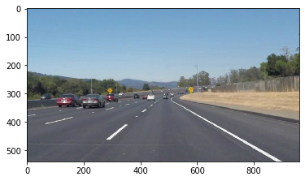
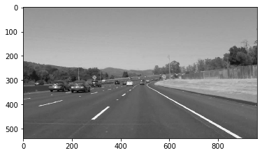
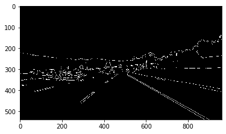
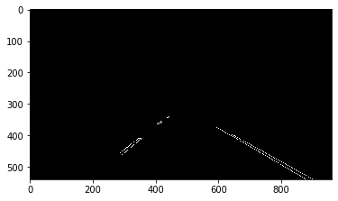
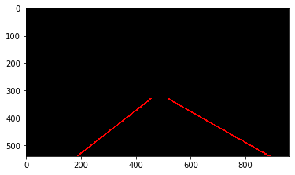
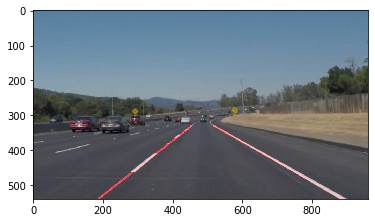

# Write Up Report - Finding Lane Lines on the Road

## Overview

When we drive, we use our eyes to decide where to go.  The lines on the road that show us where the lanes are act as our constant reference for where to steer the vehicle.  Naturally, one of the first things we would like to do in developing a self-driving car is to automatically detect lane lines using an algorithm.

In this project you will detect lane lines in images using Python and OpenCV.  OpenCV means "Open-Source Computer Vision", which is a package that has many useful tools for analyzing images.  

To complete the project, two files will be submitted: a file containing project code and a file containing a brief write up explaining your solution. We have included template files to be used both for the [code](https://github.com/udacity/CarND-LaneLines-P1/blob/master/P1.ipynb) and the [writeup](https://github.com/udacity/CarND-LaneLines-P1/blob/master/writeup_template.md).The code file is called P1.ipynb and the writeup template is writeup_template.md 

To meet specifications in the project, take a look at the requirements in the [project rubric](https://review.udacity.com/#!/rubrics/322/view)

## Required Files Overview

[LaneLines.ipynb](LaneLines.ipynb/): required code for processing images

[images_outputf folder](images_output/): required images for represent image transfer processes

[test_videos_output folder](test_videos_output/): required videos output with calculated detected road lanes

check out at youtube [solidWhiteRight](https://www.youtube.com/watch?v=emRGHFijMzM)

check out at youtube [solidYellowLeft](https://www.youtube.com/watch?v=kH-5sEtoxN4)

## Find Lane Pipeline

For this project, a detailed response to the "Reflection" section of the [project rubric](https://review.udacity.com/#!/rubrics/322/view) are provided.
There are three parts here:

#### Explain pipeline

  I built image processing pipeline and tested with all test_images. I saved the results `test_images_output` directory, and results are inline with this write-up.
  Tuned and Optimized various parameters, especially lower and higher thresholds for Canny edges and Hough lines params.
  
  some of the cv2 functions I used are:
  
  `cv2.fillPoly()` for regions selection  
  
  `cv2.line()` to draw lines on an image given endpoints  
  
  `cv2.addWeighted()` to coadd / overlay two images
  
  `cv2.cvtColor()` to grayscale or change color
  
  `cv2.imwrite()` to output images to file  
  
  `cv2.bitwise_and()` to apply a mask to an image

#### Image Processing

Workflow is described as below:

0. RGB image

1. convert RGB image to gray format

  
2. get canny edges

3. mask regional area to filter noises

4. hough_line funciton to draw lines on edge

5. combine line with original image

## Reflection

#### Pipeline Algorithm

The algorithm developed here will work in normal road condition but not with too many changes in road conditions, such as roadside trees, construction materials, potholes etc. 
Current logic is not very robust for most of the practical purposes and cannot be used for practical driving. But it serves as a starting point to develop one.
 
#### Identify any shortcomings

No shortcomings with first and second video. Optional challenge video seems tricky as it seems there are some shadows and also lanes conditions are changing. 
It might make color filters difficult to work with this real practical one.

#### Suggest possible improvements

Some more of the noise removals along with better filter logic could find and work with difficult road lanes.
